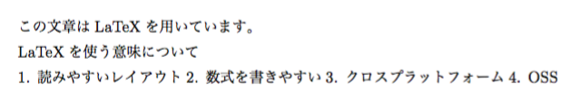
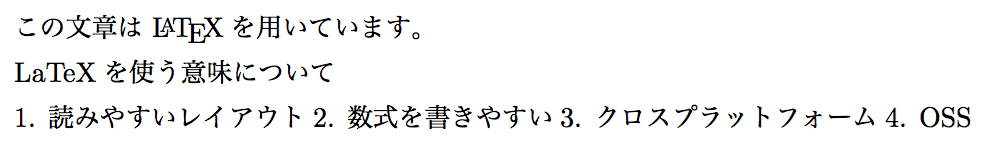
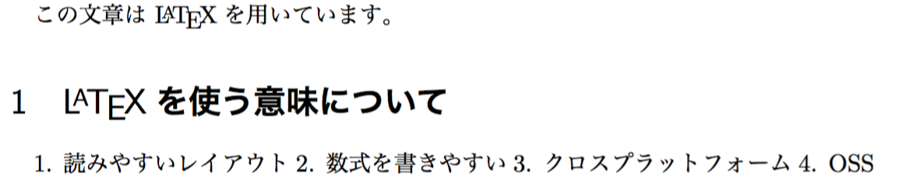
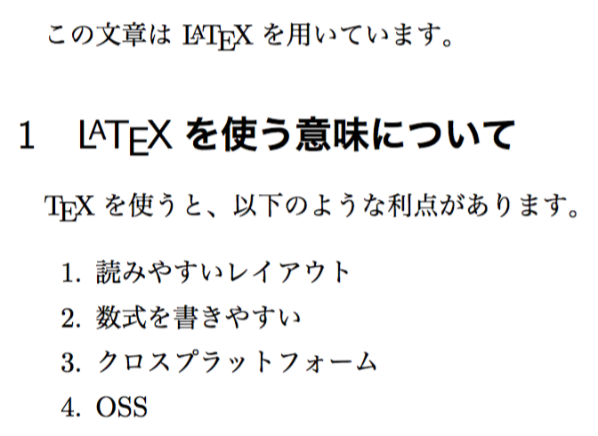
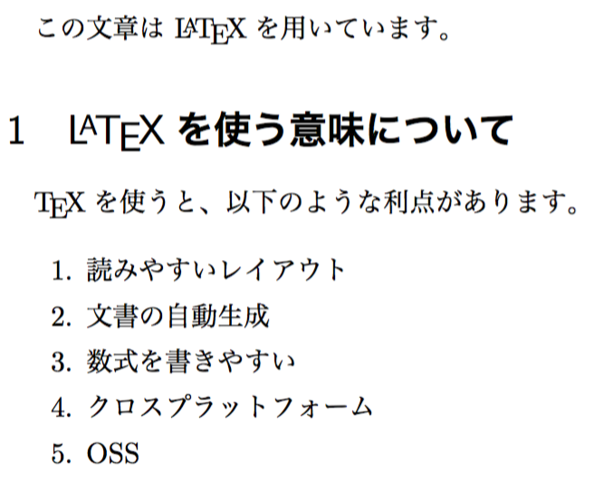
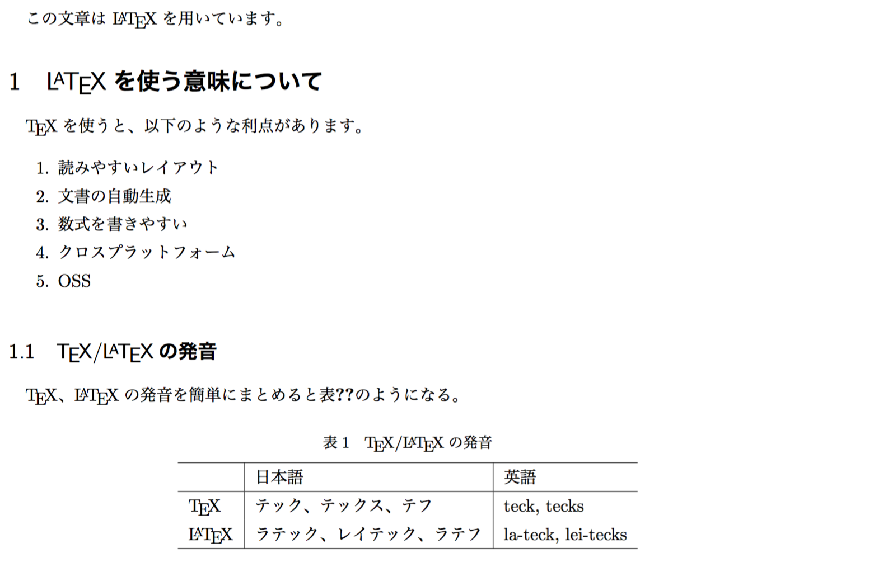
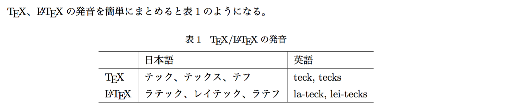

TeXの基本・簡単な扱い方
===========
TeXの基本的なやつまとめ

- [TeXとは](#about)
- [インストール](#install)
- [書く](#writing)
- [エディタ](#editor)


<a name="about">
TeXとは
-----------
TeXは1978年に開発された組版システム（typesetting system）です。
より具体的には、マークアップによって記述された文章から版を組むソフトウェア群です。
マークアップで文章を作成できるため、機械的に処理したり文章を汎用化したりするのが楽であり、
何よりクロスプラットフォームのOSSということで進化を続けています。
モノがモノですから情報系を始めとする理数系に好まれており、
論文や技術文書を書くための進化は特に著しいものとなっています。

LaTeXとは
-----------
LaTeXって何なんですか。正直分かりません。
訳分かりませんが、現在「テック」と言った場合はこのLaTeXのことを指すことが多いです。
というかTeXそのものについて話をすることはあまりないでしょう。
viとvimのような関係だと思います。
LateX2eというのはLaTeXの最新版(2016年1月現在)のことだそうです。
次バージョンは3が予定されているとか。

詳しくは[ここ](https://oku.edu.mie-u.ac.jp/~okumura/texwiki/?LaTeX "LaTeX - TeX Wik")をチェキだ！
とても分かりやすく書いてあります。


### 豆知識：発音に関して
TeXを素直に読むとテックス(/tecks/)ですが、
TeXの開発者Donald E. Knuthの著書「The TeXbook」によると
"TEX"の文字はアルファベットではなく
ギリシャ文字のタウ・イプシロン・カイの大文字から取っているらしいです。
ということで発音も一味あるという設定らしいですが、
そんなこと言われても日本でカタカナに興すときに困ります。
特にカイの部分の発音に一悶着ございまして、ざっと発音の一覧を書くと以下のようになります。

|       | 日本語                       | 英語               |
|-------|------------------------------|--------------------|
| TeX   | テック、テックス、テフ       | teck, tecks        |
| LaTeX | ラテック、レイテック、ラテフ | la-teck, lei-tecks |

ところで、上記の「The TeXbook」の練習問題1.1である

> After you have mastered the material in this book, what will you be: A TeXpert, or a TeXnician?

の解答は

> A TeXnician (underpaid); sometimes also called a TeXacker.

となっています。問題は後者で、"TeXacker"は「テック・ハッカー」ですね。
これが"TE-F\*cker"とか"TECK-S\*cker"とかなっちゃうとちょっと意味通らない以前にアレになりますね。
ということで「テック」と呼ぶのが無難だと思うぞ！


<a name="install">
インストール
-----------
TeX/LaTeXはクロスプラットフォームのソフトウェアなので、
Windows, OSX, Linux, BSDなどほとんどのOS上で動きます。
ということで、分かる範囲でTeX/LaTeX（の処理系？）のインストールについて書いていきます。

- OSX
  - [MacTeX](http://qiita.com/hideaki_polisci/items/3afd204449c6cdd995c9)
  便利なツールやよく使うパッケージがついててお得。ただ量がすごい。
  - [BasicTeX](http://qiita.com/yyamnk/items/2da2791bcee82643984f)
  「MacTeX重いわ」「無駄多いで」という人にはbasicTeX。
  私はこっち使ってます（私が誰か気になったらblameしてね）。
  basicTeXにtlmgrで必要になったパッケージを追加していくスタイル。


<a name="writing">
書く
-----------
インストールは済んだでしょうか。
細かい環境設定はまあ置いておいて、早速TeXを書いてみましょう。
体で覚えるというゴリラ戦法です。

### ハローワールド的な

```tex
\documentclass{jsarticle}
\begin{document}
この文章はLaTeXを用いています。

LaTeXを使う意味について

1. 読みやすいレイアウト
2. 数式を書きやすい
3. クロスプラットフォーム
4. OSS
\end{document}
```

ここからはお手元の環境によりますが、今回はシェル上の操作とします。
ではシェルを起動して、適当なディレクトリに移動してください。
上のtexコードを`practice.tex`として保存したら、早速コンパイルしましょう。

```sh
platex practice.tex
```

このコマンドを打つとなんかヴェアアって出力されて
`practice.log`、`practice.aux`、`practice.dvi`というファイルが生成されます。
これはそれぞれ
`.log`はplatexのビルドログ、
`.aux`は次のビルドの為の補助（auxiliary）ファイル、
`.dvi`は文書だと思っていただいて大丈夫です。
dviは "Device Independent File" の意味で、
出力デバイスに依存しない形式の版の状態です。
auxはlabelやciteなどのクロスリファレンスに使われるのですが、
これらは後でのお楽しみ。
ビルドログにはエラーメッセージなど重要な情報が載っていますので、
この先困ったらコイツを確認するようにしましょう。

細かいことは後回しにして（気になったら[Webリンク](links.md)なんかもチェキしていただいて）、
このdviを出力形式に変換するわけですが、
これは基本的にPDFに出力するものだと思っていただいて結構です。
「あーTeXをこのDTPの形式に出力できないかなー」となったときにdviからの変換ができないか調べる、
という考え方でいいと思います。

dviファイルをpdfに出力するにはdvipdfmxというソフトウェアを使います。

```sh
dvipdfmx practice.dvi
```

ちなみに、platex、dvipdfmxともに拡張子は省略できます。
気持ち悪いですがシェルスクリプトなどで自動化する際は拡張子をいちいち弄らなくて済むので楽です（でもやっぱり明示しないと気持ち悪いです）。

話は戻して、このコマンドを実行すると肝心なpdfが作成されているものと思います。
こんな感じのpdfが出力されていたらオーケーです。



ちなみに、これら二つのコマンドを連続して実行するものとして、ptex2pdfというものがあります。
オプションなど詳しくは[こちら](http://oku.edu.mie-u.ac.jp/~okumura/texwiki/?ptex2pdf)を参考に。

```sh
ptex2pdf -l practice.tex
```

### いい感じにする

さて、作成されたpdfですが、なんだかコレジャナイ感がありますね。
このイケてない文書をイケてる文書にするために以下の要件を用意しましょう。

1. "LaTeX"の文字をLaTeXのロゴにしたい
2. 二行目の内容をタイトルっぽくしたい
3. 数字付き箇条書きをそれぽっぽくしたい

それでは最初から。

```tex
\documentclass{jsarticle}
\begin{document}
この文章は \LaTeX を用いています。

LaTeXを使う意味について

1. 読みやすいレイアウト
2. 数式を書きやすい
3. クロスプラットフォーム
4. OSS
\end{document}
```

"LaTeX"の文字列にバックスラッシュ（環境によっては円マークでも大丈夫です）を入れました。
注意として、今回はうしろに空白を入れるようにしてください。



文書中のバックスラッシュを追加した部分がLaTeXのロゴになっています。
TeXには **シンボル** というものが用意されています。
copyrightのマルC記号や、トレードマークなどの記号がこれに値します。
うしろに空白を入れたのは、この形式のシンボルには閉じ記号がないため、
区切りとして空白を必要とするためです。
ナチュラルに空白を入れる英文なら気にかける必要ないんですけどね。

次に二行目をタイトルっぽくしてみます。

```tex
\documentclass{jsarticle}
\begin{document}
この文章は \LaTeX を用いています。

\section{\LaTeX を使う意味について}

1. 読みやすいレイアウト
2. 数式を書きやすい
3. クロスプラットフォーム
4. OSS
\end{document}
```



ついでにLaTeXをロゴにしました。

このようにsectionというものを使うと、
レポートや技術書によくある章・節・項を扱うことができます。
基本的に、章はsection、節はsubsection、項はsubsubsectionとなります。

最後に数字付き箇条書きをしましょう。

```tex
\documentclass{jsarticle}
\usepackage{enumitem}
\begin{document}
この文章は \LaTeX を用いています。

\section{\LaTeX を使う意味について}
\TeX を使うと、以下のような利点があります。

\begin{enumerate}
  \item 読みやすいレイアウト
  \item 数式を書きやすい
  \item クロスプラットフォーム
  \item OSS
\end{enumerate}
\end{document}
```



数字付き箇条書きにはenumerateという **環境** を使いますが、
今回は標準のenumerateを拡張する **パッケージ** であるenumitemを使ってみました。

二つ新しい用語が出ましたが、まずパッケージについて紹介します。
TeXの基本的な機能を拡張し、
組版やTeXの書き方をいいカンジにするための拡張を **パッケージ**
といいます。
パッケージを利用するには、`\usepackage`コマンドを利用します。
このコマンドによって、
組版の際に
「パッケージマネージャによって管理されている範囲」
「組版時にいるディレクトリ」
から指定されたスタイルファイルを読み込み、拡張を行います。
スタイルファイルについては後述とさせていただきます。

とりあえず考えるのは、前者の「パッケージマネージャによって管理されている範囲」です。
[インストールの項目](#install)を終えると、
platexなどの組版ソフトと一緒に`tlmgr`というソフトが入っていると思います。
これは「**T**eX**L**ive Package **M**ana**g**e**r**」の略なのですが、
どう読めばいいんですかね。
私はテルムグラとかトリモゲラとか意味わからない読み方をしています。
今回インストールしたTeXの処理系は、実は「TeXLive」というディストリビューションで、
`tlmgr`はそのパッケージマネージャとなっています。
このパッケージマネージャを使って、
公開されているスタイルをインストールして扱うことができます。

さて、今回のtexファイルをビルドしてみてください。
enumitemがundefinedだからnot foundだかというエラーが返ってくる場合があります。
これはenumitemパッケージをまだインストールしていないためです。
basicTeXなんかだと入っていません。
ということでtlmgrを使って入れてみましょう。

```
tlmgr install enumitem
```

これだけで済みます。
簡単ですね。
うまくいかなかった場合はメッセージを読んで解決してください。
たいていupdateしろとかそんなんです。
さて、インストールが済んだのでもう一度ビルドしてみてください。
今度は何も文句を言われないと思います。
このように、
こんな組版が使いたいなあと思って
パッケージを利用する必要ができたら、
パッケージマネージャを利用すると便利です。

次に、環境です。
今、情報系なあなたなら、`\begin`で始まり`\end`で終わる一つの塊を見ていると思います。
この囲まれた範囲はenumerateの **環境** にあるという言い方をします。
enumerate環境下では`\item`というシンボルを用いて箇条書きを行うことができます。

TeXの大切な利点を忘れていました。
自動的に処理すべき文書を自動生成してくれることはTeXの大きな利点の一つです。
「文書の自動生成」は二番目にインパクトのある魅力ですから、
上から二番目にこの項目を追加しましょう。

```tex
\documentclass{jsarticle}
\usepackage{enumitem}
\begin{document}
この文章は \LaTeX を用いています。

\section{\LaTeX を使う意味について}
\TeX を使うと、以下のような利点があります。

\begin{enumerate}
  \item 読みやすいレイアウト
  \item 文書の自動生成
  \item 数式を書きやすい
  \item クロスプラットフォーム
  \item OSS
\end{enumerate}
\end{document}
```



このように、
enumerate環境を用いると箇条書きに添える番号は自動的に付与してくれます。
今となってはそれほど珍しい機能ではありませんが、
TeXは私たちが1,2,3の項目を作成してから1と2の間に項目を挿入したくなった時、
挿入した項目以降の添字をいちいちずらすような滑稽な真似はさせません。

自動的な生成について、ここでもう少し触れておきたいと思います。


### ラベルと参照

`.aux`ファイルのときにも少し触れましたが、TeXには参照（referencing）という機能があります。
百聞は一見に如かずということでやってみましょう。

```tex
\documentclass{jsarticle}
\usepackage{enumitem, here}
\begin{document}
この文章は \LaTeX を用いています。

\section{\LaTeX を使う意味について}
\TeX を使うと、以下のような利点があります。

\begin{enumerate}
  \item 読みやすいレイアウト
  \item 文書の自動生成
  \item 数式を書きやすい
  \item クロスプラットフォーム
  \item OSS
\end{enumerate}

\subsection{\TeX /\LaTeX の発音}
\TeX 、\LaTeX の発音を簡単にまとめると表\ref{tb:test}のようになる。

\begin{table}[H]
  \centering
  \caption{\TeX /\LaTeX の発音}
  \label{tb:test}
  \begin{tabular}{l|l|l}
    \hline
    & 日本語 & 英語 \\
    \hline
    \TeX & テック、テックス、テフ & teck, tecks \\
    \LaTeX & ラテック、レイテック、ラテフ & la-teck, lei-tecks \\
    \hline
  \end{tabular}
\end{table}
\end{document}
```



TeXでは表、画像、ソースリストなどには自動的に番号が振られ、
目印（label）を用いて、その番号を参照することができるのです。
この際、どの表や画像にどの番号が振られているのを記録するのが`.aux`ファイルの役割です。

上の画像では表番号の参照がうまくいっていません。
あなたの画面上でも同様の表示となっていると思われますが、
これはdviの生成時に、参照するべき`.aux`ファイルが存在しないためです。

一度コンパイルするともう`.aux`ファイルは生成されていますから、
もう一度コンパイルして表示してみましょう。



今度はうまく番号が参照されました。

`.aux`はクロスリファレンスに使われると前述しましたが、
「クロス」リファレンスはお察しの通りファイルをまたぐことのできる参照です。
texは一つのファイルに長々と記述するだけでなく
`\input`や`\include`コマンドを用いてファイル分割ができるのですが、
この場合、別の場所で定義される表や図などに対しても参照はちゃんと機能するようになっています。


<!--
### 数式の記述

LaTeXを利用する大きな理由として、数式の利用しやすさがあります。
-->

<!--
### 参考文献

bibについて書くかも
-->

### 他マークアップ言語からの変換
- [org-mode](http://orgmode.org/ja/)
- Markdown

<a name="editor">
エディタ
-----------
リアルタイムプレビューとかできるGUIエディタがあるぞ！知らんけど

- [Yet Another TeX mode](https://www.yatex.org)
